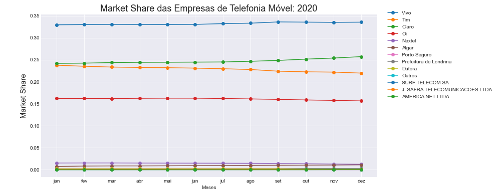
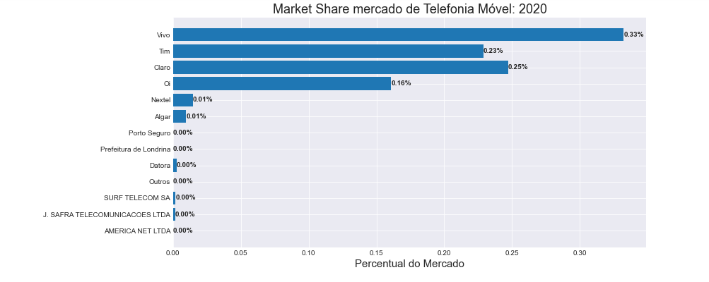

# Economia Industrial
Repositório criado para análise dos índices de concentração da indústria de telefonia móvel entre 2015 e 2020.

###Fonte de Dados: https://www.anatel.gov.br/paineis/acessos/ranking
###Acesse análise => market_share_telefoniaMovel.ipynb

O mercado de telefonia móvel no Brasil é caracterizado por grande número de empresas pequenas, com 4 principais dominando quase 97% do mercado, o que significa uma indústria fortemente oligopolizada.

As maiores são Vivo, Tim, Claro e Oi, onde se observa uma pequena variação da Tim e da Claro no segundo lugar, considerando o período total analisado, entre 2015 e 2020. A grande maioria das empresas são pequenas, pouco concorrem entre se e se mantêm com uma ínfima fatia do mercado.	

* Razão de Concentração

Este Índice é importante para determinar a participação das maiores empresas no mercado. De acordo com ele, as quatro principais empresas da indústria dominam 98% do mercado enquanto as oito principais firmas dominam 99% do mercado, delegando para as demais empresas uma pequeníssima fatia do Market Share. Isso demonstra a forte característica oligopólica do setor.

* Índice de Herfindal-Hirschman

Com este índice podemos mensurar a concentração do mercado do ponto de vista concorrencial, porque considera o total das empresas do mercado e não somente as principais. Quanto maior for o HH, mais elevada será a concentração e menor a concorrência entre as empresas. Isso se deve porque, ao elevar os percentuais ao quadrado, obtêm-se maior peso das firmas com forte participação.

Basicamente, de acordo com a tabela de  bandas referenciais, índice menor que 1.000 indica indústria pouco concentrada, valor entre 1000 e 1800 verifica-se uma concentração moderada, enquanto valor superior a 1800 tem-se uma indústria muito concentrada.

Para nosso caso, o HH do mercado de telefonia móvel foi 2.501, o que indica um mercado bastante concentrado, graças as quatro gigantes. Isso se evidencia ainda mais quando simulamos a fusão das duas empresas que disputam o segundo lugar do ranking: Tim e Claro. Neste caso, observamos a elevação de mais de 1000 pontos, para 3632, um aumento considerado bastante preocupante e que monopoliza ainda mais este mercado.

* Instabilidade do Mercado

Quanto a medida de volatilidade, verificamos uma forte estabilidade deste mercado, o que pode-se observar em todo o período analisado. O Índice foi calculado em 0.12, o que confirma a pequena movimentação e forte estabilidade das empresas,  em que as grandes mantêm confortáveis posições, enquanto as pequenas ficam iguais e pouco concorrendo entre si. A pouca variação observada se dá apenas na a entrada e saída de algumas poucas empresas menores, além de uma pequena rotatividade das duas que grandes que revesam o segundo lugar. 

* Número Equivalente
	
O número equivalente de empresas para o setor esteve muito próximo de 1 e consideravelmente distante do número real das empresas o que demonstra um irresistível poder de monopólio das gigantes. Este índice foi de 4 empresas sem considerar a nossa fusão e baixa para 2.8 empresas quando considerada a simulação feita entre a Tim e a Claro. 

* Índice de Entropia de Theil

Este índice foi de 1.51, e apenas confirma a concentração e a condição de oligopólio concentrado do mercado, graças a sua proximidade do valor 1 e da distância do seu limite superior que é de 2.6, demonstra uma tendência de concentração e monopólio.

* Conclusão:

Os dados analisados confirmam a forte monopolização do mercado de telefonia móvel no país, onde as barreiras a entrada de características técnicas e institucionais, impedem a entrada de empresas que possam concorrer com as empresas já estabelecidas. O impedimento de entrada de novas firmas, a desigualdade na participação do mercado, limitam o crescimento concorrencial e a produtividade da indústria, o que  mantêm o poder de mercado nas mãos das gigantes e impede o desenvolvimento geral do setor. 

